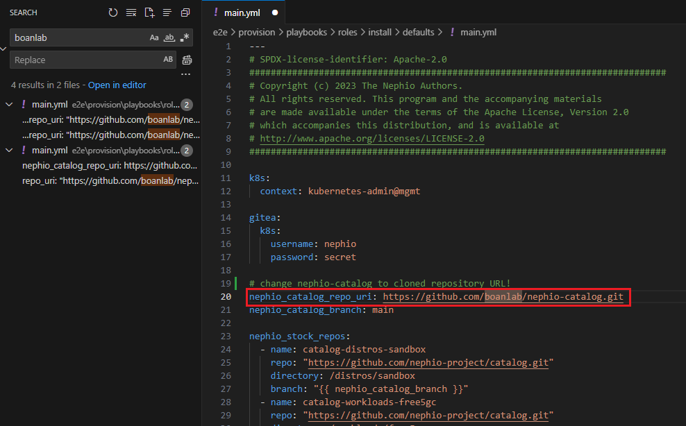

# 2. Initialize Nephio
> **IMPORTANT:** Perform this in `mgmt` cluster.

Git clone test-infra which has Ansible playbook that deploys Nephio. The original Nephio's test-infra cannot provision without Kind, so we have removed KinD by force. Change workdir to home directory and start initializing `init.sh`.
```bash
##### -----=[ In mgmt cluster ]=----- ####
$ cd ~
$ git clone https://github.com/boanlab/nephio-test-infra.git test-infra
$ export NEPHIO_USER=$USER
$ export ANSIBLE_CMD_EXTRA_VAR_LIST="k8s.context=kubernetes-admin@mgmt kind.enabled=false host_min_vcpu=4 host_min_cpu_ram=8"
$ sudo -E ./test-infra/e2e/provision/init.sh
```

> **IMPORTANT:** However, before running the init.sh script, the IP addresses of gitea and nephio-webui, nephio installation components, must be changed to the IP addresses of the subnet range of the installation environment. For this purpose, the following two tasks need to be performed.
```
1. After cloning https://github.com/boanlab/nephio-catalog.git repository to a arbitrary git repository, change the 10.10.0.131 and 10.10.0.132 IP address strings.
2. Among the codes in the downloaded test-infra directory, change the string written with the https://github.com/boanlab/nephio-catalog.git address to the cloned repository address.
```

Search and change the strings corresponding to task 1 as follows. and then, commit the modified code to the cloned repository.
```bash
$ sed 's/aaa/bbb/g' nephio-catalog/distros/gcp/nephio-mgmt/nephio-controllers/app/deployment-token-controller.yaml
$ sed 's/aaa/bbb/g' nephio-catalog/distros/sandbox/gitea/service-gitea.yaml
$ 
```

Search and change the strings corresponding to task 2 as follows.



After fix, run init.sh. and the installation sequence normally takes around 20 ~ 30 minutes, keep monitoring namespaces by:
```bash
$ watch -n 1 kubectl get ns
```

Once the `gitea/gitea-0` and `gitea/gitea-postgresql-0` starts in Nephio, we need to perform:
```bash
$ sudo chmod 777 /home/boan/nephio -R # change here to PV's hostPath
```
Otherwilse, the Nephio will get stuck while installing.

---
## [Go to Index Page](README.md)
## [Go to Next Page](3.adding_k8s_clusters_to_nephio.md)